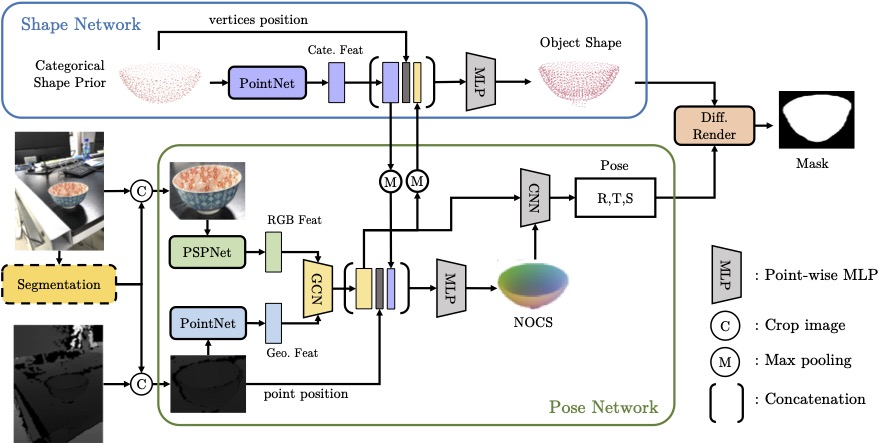

# Category-Level 6D Object Pose Estimation in the Wild: A Semi-Supervised Learning Approach and A New Dataset


This repository contains the official implementation for the following paper:

**[Category-Level 6D Object Pose Estimation in the Wild: A Semi-Supervised Learning Approach and A New Dataset](https://oasisyang.github.io/semi-pose/)**
<br/>
[Yang Fu](https://oasisyang.github.io/), 
[Xiaolong Wang](https://xiaolonw.github.io/)
<br/>
[Project Page](https://oasisyang.github.io/semi-pose/) | [Paper (arXiv)](https://arxiv.org/abs/2206.15436)

NeurIPS 2022



## Progress
- [x] Pretrained models
- [x] Evaluation script
- [x] Model architecture
- [ ] Training script
- [ ] Code cleaning

## Requirements
### Environments
- Install PyTorch>=1.8.1 [here](https://pytorch.org/get-started/locally/) based the package management tool you used and your cuda version (older PyTorch versions may work but have not been tested)
- `pip install -r requirements.txt`
### Data
Download and unzip Wild6D data from [this link](https://drive.google.com/drive/folders/1SjWUcuSvYMM5rPPd4aQhK0jo1IHbCJbT) (Testing set is only needed for evaluation). 
We highly recommend you to download Wild6D data via [gdown](https://github.com/wkentaro/gdown). For example, you can download the testing data with the following command.
    
  ```
  gdown --id 1AWLX6V0kAyiTFdkGg4FrkEaQ5jbUVtaj
  ```
We also provide a script that allows downloading all dataset files at once. In order to do so, execute the download script, 
  ```
  bash tools/download.sh
  ```


## Evaluation
- Download the pretrained model for different categories from [Google Drive](https://drive.google.com/drive/folders/1Xt-b6FF9iOOyIBuygh-SGkEiTSkF41hx) to `$MODEL_PATH`
- Pick a category name `$CATEGORY_NAME` which you can find definition in [evaluate_pose_ucsd.py](evaluate_pose_ucsd.py). Using the following code to evaluate the pretrained model.

    ```
    python evaluate_pose_ucsd.py --use_nocs_map --implicit --model $MODEL_PATH --select_class $CATEGORY_NAME
    ```
- Note that the results may be slightly different from the number reported in paper, since we further clean the dataset recently. We also provide the [estimation results](https://drive.google.com/file/d/1SRAMxBLi44y31AxFEl0Lgm86WmFPoGEF) that align with the paper number as the reference.

## Contact

Contact [Yang Fu](mailto:yafu@ucsd.edu) if you have any further questions. This repository is for academic research use only.

## Acknowledgments
Our codebase builds heavily on [NOCS](https://github.com/hughw19/NOCS_CVPR2019) and [Shape-Prior](https://github.com/mentian/object-deformnet). Thanks for open-sourcing!.

## Citation

```bibtex
@inproceedings{fucategory,
  title={Category-Level 6D Object Pose Estimation in the Wild: A Semi-Supervised Learning Approach and A New Dataset},
  author={Fu, Yang and Wang, Xiaolong},
  booktitle={Advances in Neural Information Processing Systems},
  year={2022}
}